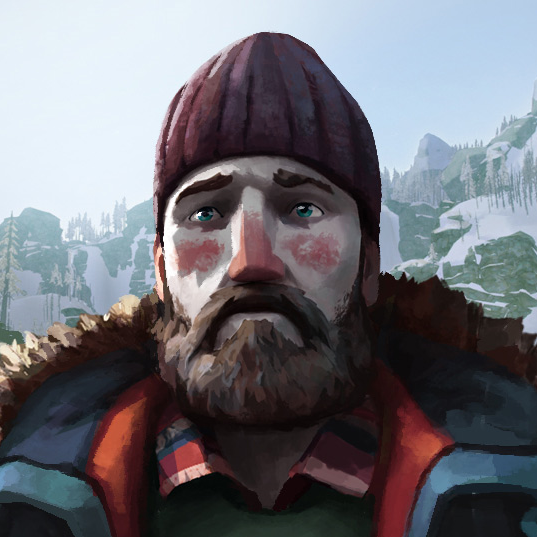

# Will Mackenzie

Isac Lindholm 2021-11-18

## Inledning
Målet är att skappa ett cv samt ett aplications brev som ska ligga på en sida med ett fungerande format så de ska gå att läsa

## Bakgrund
De första jag gjorde då jag började med att göra en skiss sida på papper sedan på figma. sedan började jag göra sidan de första och svåraste som tog längst tid försökte få svg fillen att vara i en tripel colun med en text och en png

sedan började jag göra texten och försöka få den i rad med colunen ovanför

## Positiva erfarenheter
saker jag som gått bra är att göra texten bröd texten den som inte hade något specielt och bara var rak

## Negativa erfarenheter
saker som gick dåligt var att jag höll på med svg filen mycket för fick massa problem med vars den skulle sitta i sidan den följde inte med så bra med texten och bilden

## Sammanfattning
Saker som skulle kunna gå bättre och lära sig lite mer hur man använder svg filler och får dom att följa med tex en text. kunnde ha gjort bättre så att den tex skulle fungera att använda i olika format och på mobiltelefoner